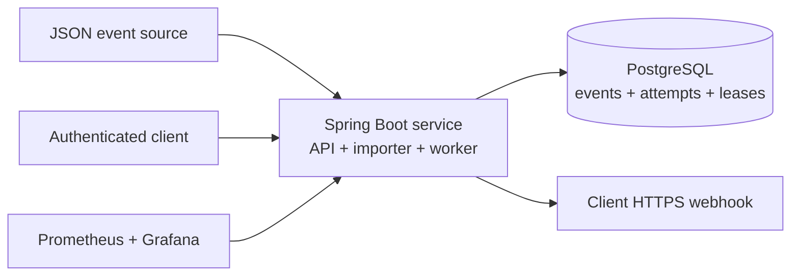

# Cobre Notification Platform

[](https://github.com/agnunezv/cobre-notifications-case/actions/workflows/quality-gate.yml)

A reliable, tenant-isolated, and observable webhook delivery service developed for Cobre's Senior Software Engineer technical case.

[Interactive solution proposal](https://cobre-notifications.andrielnunez.dev/) · [Architecture](docs/architecture-baseline.md) · [Delivery lifecycle](docs/delivery-lifecycle.md) · [Security assessment](docs/security-assessment.md) · [AI usage](docs/ai-usage.md)

## What this solution demonstrates

- At-least-once webhook delivery over HTTPS with configurable retry and backoff.
- Durable notification, delivery-cycle, and attempt state in PostgreSQL.
- Safe coordination across multiple application instances using row locks and leases.
- Tenant-scoped list, detail, and replay endpoints protected by opaque bearer tokens.
- An executable OpenAPI contract with separate client and monitoring authorization schemes.
- Client-aware metrics, operational dashboards, alert rules, and event-level investigation.
- Automated formatting, tests, coverage, mutation testing, static analysis, and dependency scanning.

The current V1 deliberately uses one Spring Boot deployable and PostgreSQL instead of introducing a broker or independently deployed workers before those components solve a measured constraint.

## Architecture at a glance



The code follows hexagonal boundaries: web, bootstrap, and scheduling adapters invoke application ports; domain and application rules remain independent from JDBC and HTTP details.

## Technology stack

- Java 21 and Spring Boot 3.5
- Gradle with Groovy DSL
- PostgreSQL 17 and Flyway
- Spring JDBC and Spring Security
- SpringDoc OpenAPI and Swagger UI
- Micrometer, Prometheus, Alertmanager, and Grafana
- JUnit 5, Testcontainers, JaCoCo, PIT, SpotBugs, Spotless, and OWASP Dependency-Check

## Run locally

### Prerequisites

- Java 21
- Docker with Docker Compose

Integration tests use Testcontainers and therefore also require a running Docker-compatible environment.

### 1. Configure the environment

```bash
cp .env.example .env
```

Edit `.env` and replace the database credentials. Also provide high-entropy values for the client and monitoring tokens you intend to use:

```dotenv
DB_USER=cobre_local
DB_PASSWORD=replace-with-a-local-password
NOTIFICATION_CLIENT_001_TOKEN=replace-with-a-client-token
NOTIFICATION_CLIENT_002_TOKEN=replace-with-a-client-token
NOTIFICATION_CLIENT_003_TOKEN=replace-with-a-client-token
NOTIFICATION_MONITORING_TOKEN=replace-with-a-monitoring-token
```

The supplied event file is imported on startup when `NOTIFICATION_JSON_IMPORT_ENABLED=true`. Repeated imports are idempotent by `event_id`.

### 2. Create local infrastructure secrets

Compose reads secrets from ignored local files. The Prometheus token must contain the same value configured as `NOTIFICATION_MONITORING_TOKEN`:

```bash
mkdir -p .docker/secrets
printf '%s' 'replace-with-the-same-monitoring-token' > .docker/secrets/prometheus-bearer-token
printf '%s' 'replace-with-a-grafana-password' > .docker/secrets/grafana-admin-password
printf '%s' 'replace-with-an-alert-webhook-token' > .docker/secrets/alertmanager-webhook-token
```

Neither `.env` nor `.docker/` is tracked by Git.

### 3. Start PostgreSQL and the application

```bash
docker compose up -d --wait postgres
./gradlew bootRun
```

Verify the application:

```bash
curl http://localhost:8080/actuator/health
```

Flyway creates the schema automatically. With the example import enabled, a fresh database contains the ten notification events supplied with the case.

The local executable API contract is available at:

- Swagger UI: [http://localhost:8080/swagger-ui.html](http://localhost:8080/swagger-ui.html)
- OpenAPI JSON: [http://localhost:8080/v3/api-docs](http://localhost:8080/v3/api-docs)

Both documentation routes are intentionally public for the local demonstration. Use Swagger UI's **Authorize** action with a configured client token for self-service operations or the monitoring token for the read-only investigation endpoint. Set `OPENAPI_ENABLED=false`, or protect these routes at the ingress, before exposing an equivalent deployment publicly.

## Self-service API

All self-service endpoints derive `client_id` from the bearer token. A missing event and an event owned by another client both return `404 Not Found` to avoid disclosing cross-tenant existence.

The table below is a quick reference; Swagger UI is the executable source for parameters, response codes, schemas, and the two opaque bearer-token roles.

| Method | Endpoint | Behavior |
| --- | --- | --- |
| `GET` | `/notification_events` | Lists the authenticated client's events with optional date and status filters. |
| `GET` | `/notification_events/{event_id}` | Returns one tenant-scoped event. |
| `POST` | `/notification_events/{event_id}/replay` | Schedules a new delivery cycle for a `FAILED` event and returns `202 Accepted`. |

The list endpoint accepts `created_from`, `created_to`, `delivery_status`, `page`, and `size`. Page size is bounded to 100.

The imported `EVT003` belongs to `CLIENT002` and starts in `FAILED`, making it useful for a fresh local demonstration:

```bash
export CLIENT_002_TOKEN='the-value-configured-for-client-002'

curl --fail-with-body \
  -H "Authorization: Bearer ${CLIENT_002_TOKEN}" \
  'http://localhost:8080/notification_events?delivery_status=FAILED&page=0&size=20'

curl --fail-with-body \
  -H "Authorization: Bearer ${CLIENT_002_TOKEN}" \
  http://localhost:8080/notification_events/EVT003

curl -i -X POST \
  -H "Authorization: Bearer ${CLIENT_002_TOKEN}" \
  http://localhost:8080/notification_events/EVT003/replay
```

The `POST` request changes the persisted state. With the worker disabled, the accepted event remains due until a worker is enabled. Replaying an event outside `FAILED` returns `409 Conflict`. Concurrent replay requests are also protected by the persisted state transition.

## Demonstrate webhook delivery

The worker and subscription bootstrap are disabled by default so the application can be explored without sending external requests. To exercise the end-to-end delivery flow, configure the controlled HTTPS receiver provided for the demonstration in `.env` before starting the application:

```dotenv
NOTIFICATION_SUBSCRIPTION_BOOTSTRAP_ENABLED=true
NOTIFICATION_SUBSCRIPTION_BOOTSTRAP_ENDPOINT_URL=https://your-controlled-receiver.example/webhook
NOTIFICATION_WORKER_ENABLED=true
```

The declarative bootstrap configures three tenant-scoped subscriptions atomically during one startup and points them to the same physical webhook. Each subscription contains the event types present for its client in the supplied case data. Repeated startup is idempotent by `subscription_id`. Endpoint URLs are not unique in persistence, so the routing model can assign independent URLs later without a schema or domain change.

On a fresh database, start with this configuration and then replay `EVT003`. If it was already replayed while the worker was disabled, restarting with this configuration is sufficient: the worker will claim the existing due event. It persists every attempt, sends the webhook, and moves the event to `COMPLETED`, `RETRY_SCHEDULED`, or `FAILED` according to the outcome and retry policy.

An event without an exact active match for its `client_id` and `event_type` fails safely with `SUBSCRIPTION_NOT_FOUND`; the platform does not fall back to another client's subscription. The event and its delivery intent remain persisted. After adding the missing route and restarting the application, an operator must replay the `FAILED` event so the new delivery cycle resolves and snapshots the destination.

Changing the shared URL affects deliveries that have not yet captured a destination and new replay cycles. Automatic retries inside an existing cycle continue using `destination_url_snapshot`. Removing an entry from configuration does not deactivate its persisted subscription; dynamic onboarding, deactivation, and authoritative reconciliation remain outside this bootstrap's V1 scope.

Delivery is intentionally at-least-once. The shared receiver gets `client_id` in the JSON envelope, the stable `event_id` as `Idempotency-Key`, and a per-attempt `X-Correlation-Id`. A timeout or worker crash can leave the outcome ambiguous, so consumers must atomically deduplicate the resulting side effect; the header communicates the key but cannot enforce receiver behavior.

## Observability

Start the optional local monitoring profile while the application is running on port `8080`:

```bash
docker compose --profile observability up -d
```

| Component | URL | Purpose |
| --- | --- | --- |
| Grafana | [http://localhost:3000](http://localhost:3000) | Provisioned delivery-operations and runtime-health dashboards. |
| Prometheus | [http://localhost:9090](http://localhost:9090) | Metrics, rules, and active alert state. |
| Alertmanager | [http://localhost:9093](http://localhost:9093) | Alert grouping, routing, deduplication, and recovery. |

Grafana uses `GRAFANA_ADMIN_USER` from `.env` and the password stored in `.docker/secrets/grafana-admin-password`.

The metrics and investigation surfaces require the read-only monitoring identity:

```bash
export MONITORING_TOKEN='the-value-configured-for-monitoring'

curl --fail-with-body \
  -H "Authorization: Bearer ${MONITORING_TOKEN}" \
  http://localhost:8080/actuator/prometheus

curl --fail-with-body \
  -H "Authorization: Bearer ${MONITORING_TOKEN}" \
  'http://localhost:8080/internal/monitoring/notification_events/EVT003?client_id=CLIENT002'
```

Metrics use bounded labels such as `client_id`, `event_type`, result, and failure category. Event IDs, payloads, destinations, and raw failure details remain outside metrics; event-level diagnosis uses the persisted investigation endpoint.

The Alertmanager configuration targets an optional demo receiver on host port `19093` for native macOS notifications. Dashboards, metric collection, and alert evaluation remain usable when that external receiver is not running.

## Quality gates

```bash
# Formatting, unit tests, PostgreSQL integration tests, coverage, and SpotBugs
./gradlew clean check

# Mutation testing
./gradlew pitest

# Production dependency vulnerability scan
./gradlew dependencyCheckAnalyze
```

Apply the repository's formatting rules with:

```bash
./gradlew spotlessApply
```

Generated reports are available at:

| Report | Path |
| --- | --- |
| Unit tests | `build/reports/tests/test/index.html` |
| Integration tests | `build/reports/tests/integrationTest/index.html` |
| JaCoCo | `build/reports/jacoco/test/html/index.html` |
| PIT mutation testing | `build/reports/pitest/index.html` |
| SpotBugs | `build/reports/spotbugs/main.html` |
| Dependency-Check | `build/reports/dependency-check-report.html` |

The GitHub Actions quality gate runs build and tests, mutation testing, and dependency security as separate jobs on every push to `main`. JaCoCo enforces at least 90% line coverage and 70% branch coverage; PIT enforces a 70% mutation threshold.

## Key decisions and trade-offs

| Decision | Current benefit | Accepted trade-off and evolution trigger |
| --- | --- | --- |
| PostgreSQL instead of H2 | Exercises the production SQL dialect, row locking, indexes, and real concurrency behavior. | Heavier local setup; reconsider only if a narrower unit-test feedback loop needs an additional test double. |
| One deployable | Keeps the V1 operational model and local demonstration simple. | API and worker scale together; split them when independent scaling or isolation becomes measurable. |
| Database-backed claims and leases | Supports multiple instances without introducing a broker. | Polling consumes database capacity; introduce a queue when contention or delivery throughput proves this model insufficient. |
| Explicit JDBC | Makes tenant predicates, locking, and state transitions visible. | More SQL is maintained by the application; centralize or adopt another abstraction if query volume and duplication grow materially. |
| At-least-once delivery | Preserves reliability when timeouts and crashes make outcomes ambiguous. | Duplicate delivery remains possible; consumers must deduplicate by event identifier. |
| Offset pagination | Simple and sufficient for the bounded case dataset. | Move to cursor pagination when deep pages produce measurable latency or inconsistent navigation under concurrent inserts. |
| Configured opaque tokens | Small and understandable for a local technical case. | Before public exposure, use TLS, managed secrets, rate limiting, rotation, and OAuth 2.0 client credentials with short-lived tokens. |

## Current V1 boundaries

The repository does not claim to provide subscription-management APIs, a message broker, webhook signing, public-production identity management, rate limiting, multi-region delivery, or a production on-call channel. These are explicit evolution options, not hidden current capabilities.

For the complete reasoning and implemented boundaries, use the [interactive proposal](https://cobre-notifications.andrielnunez.dev/) and the documents linked at the top of this README.
