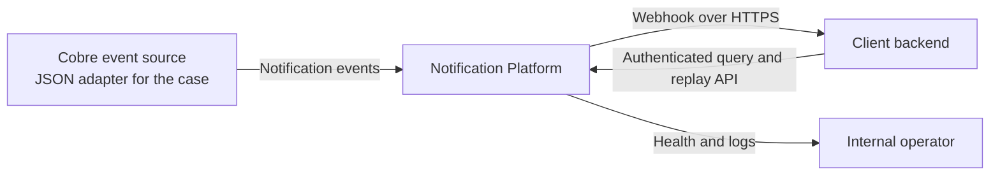
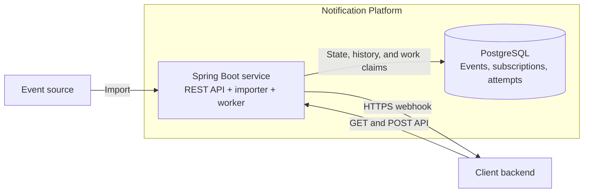
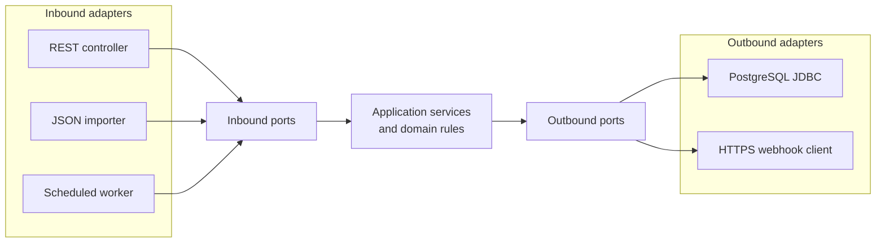

# Notification Platform Architecture

## Purpose

This document describes the implemented V1 architecture, its boundaries, and
the decisions that shape it. Capabilities that are not implemented are called
out explicitly rather than presented as part of the current system.

## Current product scope

V1 provides:

- Configurable, idempotent import of the case notification JSON file.
- Tenant-safe subscription resolution by client and event type.
- At-least-once webhook delivery over HTTPS with configurable retries.
- Durable event state, delivery cycles, and individual attempt outcomes.
- An authenticated API to list, inspect, and replay notification events.
- Database-backed worker coordination across application instances.
- Health endpoints and operational logs.

V1 does not provide subscription-management APIs, a message broker, webhook
signing, lease recovery, metrics and alerts, or multi-region delivery.

## System context

The platform owns notification delivery and its operational history. It does
not own the business event that caused the notification or the side effect
performed by the client after receiving it.

## Runtime containers

One Spring Boot deployable is sufficient for V1. The API, bootstrap importer,
and scheduled worker are separate inbound adapters but share the same
application and deployment unit.

## Hexagonal boundaries

The application layer depends on ports, not on Spring MVC, JDBC, or the HTTP
client. Domain rules such as valid delivery transitions and retry limits remain
independent of adapter details.

## Implemented flows

### Event intake

The optional startup importer reads and validates the supplied JSON file. It
uses the time accepted by this platform as `created_at`, preserves the source
`delivery_date`, and inserts events in batches. `ON CONFLICT (event_id) DO
NOTHING` makes repeated startup imports idempotent. The adapter can later be
replaced by a broker consumer without changing the delivery use cases.

### Self-service API

| Endpoint | Behavior |
| --- | --- |
| `GET /notification_events` | Lists only the authenticated client's events. Supports creation-date and delivery-status filters plus bounded offset pagination. |
| `GET /notification_events/{notification_event_id}` | Returns one tenant-scoped event without internal worker or destination data. |
| `POST /notification_events/{notification_event_id}/replay` | Accepts only a `FAILED` event and schedules a new asynchronous delivery cycle. |

The replay endpoint returns `202 Accepted`. A missing event and an event owned
by another client produce the same `404` response. Replaying an event in any
state other than `FAILED` produces `409 Conflict`.

### Notification delivery

The worker claims due rows in bounded batches using PostgreSQL row locks and
`SKIP LOCKED`. It resolves a client-owned subscription, snapshots the selected
destination, records an attempt, performs the HTTPS request outside the
database transaction, and atomically stores the attempt outcome and next event
state.

## Security and tenant isolation

V1 maps configured bearer tokens to a `client_id`. Tokens are supplied through
environment configuration and compared using `MessageDigest.isEqual`. Every
self-service query and replay transition includes the authenticated client in
its SQL predicate, preventing cross-client reads or mutations.

Static bearer tokens are appropriate for a local technical case, not for a
public production API. Production should use short-lived credentials from an
identity provider, managed secret storage, rotation, authorization scopes, and
a separate identity or private network for operational endpoints.

## Key decisions

| Decision | Trade-off | Revisit when |
| --- | --- | --- |
| One Spring Boot deployable | API and worker cannot scale or deploy independently. | Their workload, ownership, or release cadence diverges. |
| PostgreSQL as state store and work queue | Avoids broker complexity but consumes database capacity through polling and claims. | Measured volume, burst size, or database pressure justifies a broker or outbox path. |
| At-least-once delivery | A timeout can cause a duplicate even with durable local state. | Strengthen the client idempotency contract; do not promise exactly-once HTTP delivery. |
| Sequential processing inside each batch | Failure isolation and reasoning are simple, but one slow endpoint delays the rest of the batch. | Latency or throughput requires bounded parallelism. |
| Offset pagination with a maximum page size | The contract is familiar and adequate for the case dataset, but deep pages become slower. | Dataset size and measured query latency justify cursor pagination. |
| Static bearer-token authentication | Small local setup with no identity infrastructure. | The API is exposed publicly or requires token lifecycle and authorization roles. |
| Hexagonal packages in one Gradle module | Keeps the project lightweight; boundaries depend partly on engineering discipline. | Team growth or repeated boundary violations justify module-level enforcement. |

## Current operational gaps

- Actuator health checks and application logs exist; delivery
  metrics, dashboards, and alerts are the next planned increment.
- Expired worker leases are stored but not yet recovered automatically.
- A repeated replay after the first accepted transition returns `409`; V1 does
  not implement an `Idempotency-Key` contract.
- The attached JSON file is a case-specific ingress adapter, not the target
  production integration with Cobre event-producing systems.
