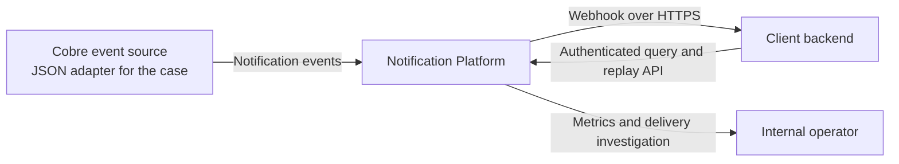
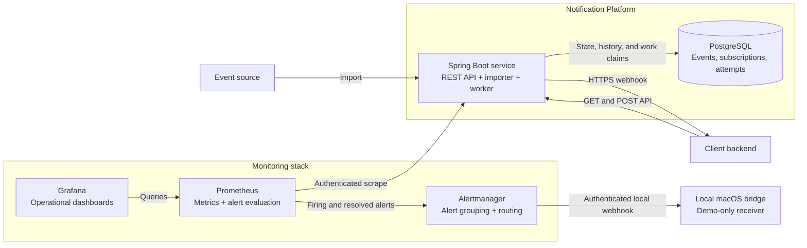
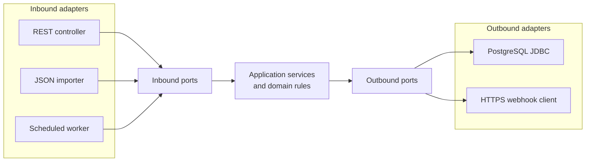

# Notification Platform Architecture

## Purpose

This document describes the implemented V1 architecture, its boundaries, and
the decisions that shape it. Capabilities that are not implemented are called
out explicitly rather than presented as part of the current system.

## Current product scope

V1 provides:

- Configurable, idempotent import of the case notification JSON file.
- Optional configuration bootstrap for the HTTPS subscriptions used in a local
  demonstration.
- Tenant-safe subscription resolution by client and event type.
- At-least-once webhook delivery over HTTPS with configurable retries.
- Durable event state, delivery cycles, and individual attempt outcomes.
- Automatic recovery of expired worker leases.
- An authenticated API to list, inspect, and replay notification events.
- A local executable OpenAPI contract for the self-service and internal
  monitoring HTTP surfaces.
- Database-backed worker coordination across application instances.
- Health endpoints, operational logs, Prometheus delivery metrics, and an
  optional local monitoring stack.
- Client-aware delivery diagnostics and a read-only internal investigation
  endpoint backed by the persisted attempt timeline.

V1 does not provide subscription-management APIs, a message broker, webhook
signing, external alert notifications, or multi-region delivery.

## System context

The platform owns notification delivery and its operational history. It does
not own the business event that caused the notification or the side effect
performed by the client after receiving it.

## Runtime containers

One Spring Boot deployable is sufficient for V1. The API, bootstrap importer,
and scheduled worker are separate inbound adapters but share the same
application and deployment unit.

## Hexagonal boundaries

The application layer depends on ports, not on Spring MVC, JDBC, or the HTTP
client. Domain rules such as valid delivery transitions and retry limits remain
independent of adapter details.

## Implemented flows

### Event intake

The optional startup importer reads and validates the supplied JSON file. It
uses the time accepted by this platform as `created_at`, preserves the source
`delivery_date`, and inserts events in batches. `ON CONFLICT (event_id) DO
NOTHING` makes repeated startup imports idempotent.

The optional subscription bootstrap provides the clients, shared HTTPS
endpoint, and event types needed for the demonstration. It validates the
complete declared list before writing and configures three tenant-scoped
subscriptions in one transaction. The subscriptions intentionally share one
physical webhook while preserving independent client and event-type routes;
the database does not require endpoint URLs to be unique. Each stable
subscription identifier is updated idempotently and cannot be reassigned to
another client. The bootstrap is additive: omitting an existing identifier
does not deactivate it. It is not a replacement for a production
subscription-management capability.

### Self-service API

| Endpoint | Behavior |
| --- | --- |
| `GET /notification_events` | Lists only the authenticated client's events. Supports creation-date and delivery-status filters plus bounded offset pagination. |
| `GET /notification_events/{notification_event_id}` | Returns one tenant-scoped event without internal worker or destination data. |
| `POST /notification_events/{notification_event_id}/replay` | Accepts only a `FAILED` event and schedules a new asynchronous delivery cycle. |

The replay endpoint returns `202 Accepted`. A missing event and an event owned
by another client produce the same `404` response. Replaying an event in any
state other than `FAILED` produces `409 Conflict`.

### Internal delivery investigation

`GET /internal/monitoring/notification_events/{notification_event_id}` requires
both a monitoring bearer token and a `client_id` query parameter. It returns
the event's operational state and ordered attempt timeline, including result,
HTTP status, bounded failure category, latency, and correlation identifier.
The response intentionally excludes the payload and destination URL.

The client identifier makes the investigation explicit and prevents an event
identifier alone from becoming a cross-client lookup. A missing event and an
event associated with another client both return `404`. The repository reads
one event by its primary key and its attempts through the existing
`(event_id, delivery_cycle, attempt_number)` index; no additional index or
schema migration is required for this access pattern.

### Executable API contract

SpringDoc derives an OpenAPI 3 contract from the implemented controllers and
their explicit response documentation. Swagger UI exposes the contract at
`/swagger-ui.html`, while `/v3/api-docs` provides the machine-readable JSON.
The contract distinguishes the tenant-scoped `clientBearer` identity from the
read-only `monitoringBearer` identity and does not describe either opaque token
as a JWT.

The documentation routes are unauthenticated for the local demonstration so a
reviewer can discover the API before supplying credentials through Swagger
UI. A public deployment must either disable them with `OPENAPI_ENABLED=false`
or protect them at the ingress; the internal monitoring operation should also
remain on a private operational route.

### Notification delivery

The worker claims due rows in bounded batches using PostgreSQL row locks and
`SKIP LOCKED`. It resolves a client-owned subscription, snapshots the selected
destination, records an attempt, performs the HTTPS request outside the
database transaction, and atomically stores the attempt outcome and next event
state. Before each claim, it also recovers a bounded set of expired leases. A
claim abandoned before opening an HTTP attempt is immediately rescheduled; an
open attempt is closed as retryable and follows the configured retry policy.
Late results cannot overwrite a recovered delivery.

Resolution requires one exact active match for `client_id` and `event_type`.
No match produces a persisted `FAILED` event with
`SUBSCRIPTION_NOT_FOUND`; multiple matches fail safely as ambiguous. After a
missing route is added through configuration and the application restarts, the
operator replays the failed event to open a new cycle and resolve the newly
available destination. The persisted event and failure evidence are not lost.

## Security and tenant isolation

V1 maps configured client bearer tokens to a `client_id` and grants them only
the client role. A separate monitoring token grants only the monitoring role;
client tokens cannot access internal investigation routes, and the monitoring
identity cannot impersonate a client on self-service routes. Tokens are
supplied through environment configuration and compared using
`MessageDigest.isEqual`. Every self-service query and replay transition
includes the authenticated client in its SQL predicate, preventing
cross-client reads or mutations.

Static bearer tokens are appropriate for a local technical case, not for a
public production API. The local Prometheus endpoint and read-only delivery
investigation API share the monitoring identity; client identities cannot
access either operational surface, and the monitoring identity cannot call the
self-service API. Production should use short-lived credentials from an
identity provider, managed secret storage, rotation, narrower authorization
scopes, and a separate identity or private network for operational endpoints.

The focused [OWASP risk assessment](security-assessment.md) maps the public API
threats to implemented code and separates current controls from measures that
belong at a production deployment boundary.

## Key decisions

| Decision | Rationale | Trade-off |
| --- | --- | --- |
| One Spring Boot deployable | Keeps the case cohesive and operationally simple. | API and worker share scaling and release boundaries. |
| PostgreSQL as state store and work queue | Provides durable state and coordinated claims without another runtime dependency. | Polling and claims consume database capacity. |
| At-least-once delivery | Reflects the ambiguity of failures across an HTTP boundary. | A timeout can produce a duplicate even with durable local state. |
| Event ID as outbound idempotency key | Gives a shared receiver one stable key across retries and replays. | Exactly-once effects still depend on atomic deduplication by the consumer. |
| Sequential processing inside each batch | Makes failure isolation and execution easy to reason about. | One slow endpoint delays the remaining events in that batch. |
| Offset pagination with a maximum page size | Provides a familiar bounded contract for the case dataset. | Deep pages become progressively more expensive. |
| Static role-scoped bearer tokens | Provides client and monitoring isolation with a small local setup. | Does not provide credential lifecycle or centralized identity management. |
| Public Swagger UI in local execution | Makes the implemented HTTP contract directly testable during the case review. | Disable or protect documentation and internal operations before public exposure. |
| Client and event type as metric labels | Makes an affected configured client directly discoverable. | Time-series cardinality grows with clients and event types. |
| Separate delivery and runtime dashboards | Keeps client diagnosis separate from component-capacity analysis. | Operators sometimes navigate between two views. |
| Alertmanager with a separate local macOS bridge | Demonstrates grouping, routing, deduplication, and recovery outside product code. | The local receiver is not a production on-call channel. |
| Hexagonal packages in one Gradle module | Keeps boundaries visible without adding module overhead. | Boundary enforcement depends partly on engineering discipline. |

## Current scope boundaries

- The local monitoring profile can route alerts through Alertmanager to an
  authenticated macOS bridge for the demo. This is not a production on-call
  destination and does not provide production-grade fault isolation.
- Prometheus can monitor Grafana and itself while running, but an external
  monitor is still required to detect loss of the whole monitoring stack.
- A repeated replay after the first accepted transition returns `409`; the
  self-service endpoint does not accept an inbound idempotency key. Outbound
  webhook attempts separately send the stable event identifier as
  `Idempotency-Key`.
- The attached JSON file is a case-specific ingress adapter, not the target
  production integration with Cobre event-producing systems.
