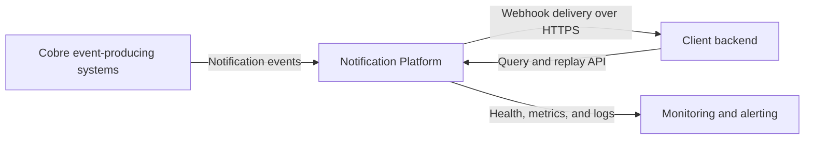
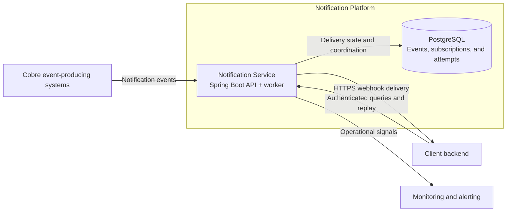

# Notification Platform Architecture Baseline

## Purpose

This document provides the minimum architectural direction required to start
implementing the notification platform. Details will be added only when the
corresponding behavior is designed or implemented.

## Scope

### In scope

- Reliable webhook delivery with retry and controlled replay.
- A tenant-aware API to list, inspect, and replay notification events.
- Durable delivery state and attempt history.
- A path to horizontal worker coordination and operational visibility.

### Out of scope for V1

- Exactly-once delivery across HTTP.
- Creation of upstream business events.
- Subscription-management APIs or a customer dashboard.
- A message broker, multiple microservices, or active-active multi-region
  delivery.

## Assumptions

1. Each event has a stable identifier, belongs to one client, and has an
   immutable payload.
2. V1 resolves one active webhook destination for each event.
3. Client destinations use HTTPS, and a `2xx` response means the delivery was
   accepted.
4. Delivery is at-least-once; clients use the event identifier to deduplicate.
5. PostgreSQL is the source of truth. Retry timing and limits are configurable.

## C4 — System context

The platform owns delivery orchestration and history. It does not own the
business event that caused the notification or the client's internal side
effect.

## C4 — Containers

V1 uses one Spring Boot deployable and PostgreSQL. The API and worker remain
separate adapters inside the application, but they do not require separate
services yet.

## Key decisions

| Decision | Trade-off | Revisit when |
| --- | --- | --- |
| One Spring Boot deployable | API and worker cannot be deployed independently. | Their workloads, release cadence, or ownership diverge. |
| PostgreSQL as source of truth | Polling and claims use database capacity. | Database pressure or delivery latency becomes measurable. |
| At-least-once delivery | A timeout or worker failure can produce a duplicate. | Strengthen client idempotency contracts; do not promise exactly-once. |
| Database-backed work claims before a broker | Burst absorption is limited. | Volume, producer coupling, or polling overhead justifies a queue/outbox path. |
| Hexagonal boundaries in one Gradle module | Package boundaries rely partly on discipline. | Teams, build time, or repeated boundary violations require stronger isolation. |

## Deferred details

Retry schedules, lease duration, worker concurrency, authentication provisioning,
retention, and alert thresholds will be defined in the increments that implement
them.
