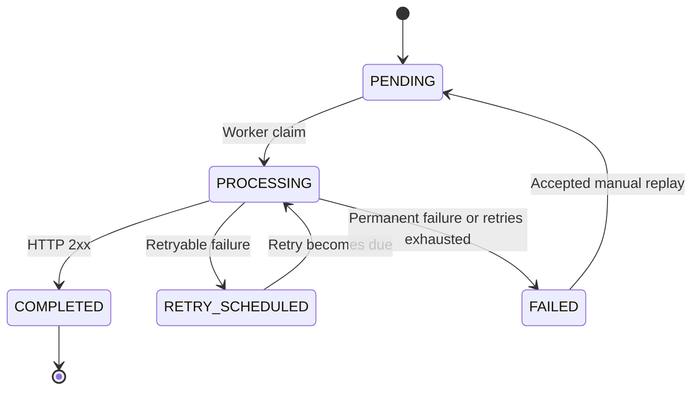
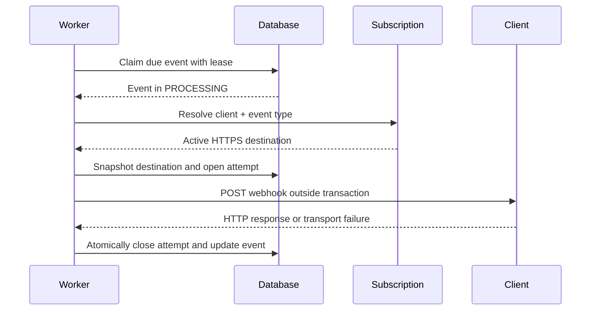

# Notification Delivery Lifecycle

This document defines the implemented delivery state machine. An event keeps
its identity across delivery cycles, while every HTTP attempt is stored as a
separate record.

## States

- `PENDING`: ready to be claimed for delivery.
- `PROCESSING`: owned by a worker under a time-bounded lease.
- `RETRY_SCHEDULED`: waiting until the next configured attempt time.
- `COMPLETED`: accepted by the client with a `2xx` response.
- `FAILED`: the current cycle ended after a permanent failure or exhausted
  retries.

## State transitions

Only the domain lifecycle decides whether a transition is valid. Persistence
queries also include the expected state as a defensive concurrency check.

## Event timestamps

- `created_at` is when this platform first accepts the event. For the case JSON
  importer, all records in one import share that acceptance time.
- `delivery_date` comes from the supplied event and is not changed by delivery
  attempts or replay.
- `delivered_at` is the operational time when this implementation receives a
  successful `2xx` response.
- `next_attempt_at` determines when a `PENDING` or `RETRY_SCHEDULED` event is
  eligible for a worker claim.

Keeping source and operational timestamps separate avoids rewriting input data
when the platform performs a later delivery or replay.

## Delivery sequence

The worker sends `event_id`, `event_type`, and `content` as JSON, with
`X-Notification-Event-Id` and `X-Correlation-Id` headers.

## Subscription and destination rules

The initial delivery requires exactly one active subscription matching both the
event's `client_id` and `event_type`. No match, multiple matches, or an invalid
HTTPS destination ends the current cycle as a configuration failure.

Once selected, the destination is snapshotted and reused by automatic retries
within the same cycle. Manual replay clears the previous snapshot so the new
cycle validates the client's current subscription configuration.

## Attempt outcomes

| Condition | Result |
| --- | --- |
| HTTP `2xx` | Success; event becomes `COMPLETED`. |
| HTTP `408`, `429`, or `5xx` | Retryable failure. |
| Timeout, connection, DNS, or routing failure | Retryable failure. |
| TLS validation failure | Permanent failure. |
| Other `3xx` or `4xx` response | Permanent failure. |
| HTTP client cannot construct or process the request | Permanent failure. |

Every attempt records its cycle, sequence number, origin, timestamps, result,
HTTP status when present, failure category, sanitized description, latency, and
correlation identifier. Imported historical events are marked as having
incomplete attempt history because the case file contains final state but not
the attempts that produced it.

## Retry policy

V1 uses one configurable retry policy. `maximum-attempts` includes the initial
attempt; the configured delays provide one wait duration for each automatic
retry. The default is four total attempts with delays of 1, 5, and 30 seconds.

Timeouts are ambiguous: the client might have processed the request even though
the platform did not receive its response. They remain retryable, which is why
the delivery guarantee is at-least-once and clients must deduplicate by event
identifier.

## Claims and completion consistency

- Claims use `FOR UPDATE SKIP LOCKED`, allowing multiple service instances to
  claim different events without waiting on the same rows.
- A lease identifies the worker and bounds claim ownership.
- Only one unfinished attempt is allowed per event and delivery cycle.
- The remote HTTP call is never executed while holding a database transaction.
- Attempt completion locks the current event and attempt, then updates both in
  one transaction.
- Duplicate or late results cannot overwrite an already closed attempt.
- One event failure is isolated from the rest of its batch.

V1 processes each claimed batch sequentially. Batch size, HTTP timeouts, and
lease duration must therefore be configured together so the lease covers the
worst expected batch duration.

Scheduled polling is disabled by default to prevent accidental outbound calls.
When enabled, each application instance runs one fixed-delay worker and relies
on PostgreSQL claims to coordinate with the other instances.

## Manual replay

Replay is tenant-scoped and valid only from `FAILED`. PostgreSQL locks the event
before the transition so two simultaneous requests cannot start two cycles.
The accepted request:

1. Changes the state to `PENDING`.
2. Increments `delivery_cycle`.
3. Schedules the event immediately through `next_attempt_at`.
4. Clears leases, operational success time, and the previous destination
   snapshot.
5. Preserves the event identifier, source payload, `delivery_date`, and previous
   attempt records.

The worker later creates the first attempt of the new cycle with origin
`MANUAL_REPLAY`. A second request sees `PENDING` and receives `409 Conflict`.

## Known limitation

An expired `PROCESSING` lease is not yet returned automatically to a claimable
state. Lease recovery should preserve the same cycle and classify the next
attempt as `LEASE_RECOVERY`; it belongs in a separate increment because it
changes failure-recovery behavior rather than the normal delivery path.
