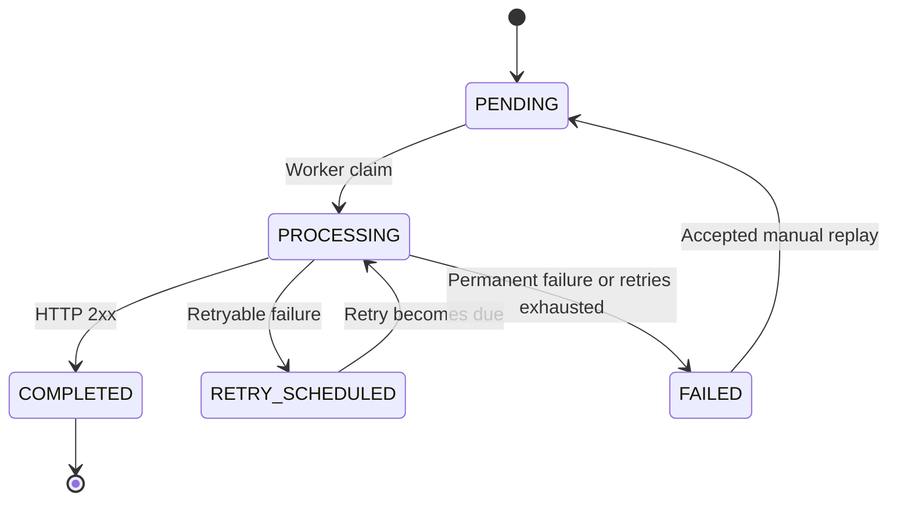
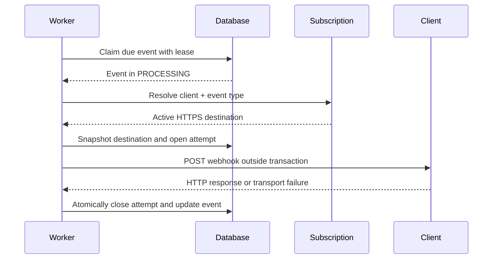

# Notification Delivery Lifecycle

This document defines the implemented delivery state machine. An event keeps
its identity across delivery cycles, while every HTTP attempt is stored as a
separate record.

## States

- `PENDING`: ready to be claimed for delivery.
- `PROCESSING`: owned by a worker under a time-bounded lease.
- `RETRY_SCHEDULED`: waiting until the next configured attempt time.
- `COMPLETED`: accepted by the client with a `2xx` response.
- `FAILED`: the current cycle ended after a permanent failure or exhausted
  retries.

## State transitions

Only the domain lifecycle decides whether a transition is valid. Persistence
queries also include the expected state as a defensive concurrency check.

## Event timestamps

- `created_at` is when this platform first accepts the event. For the case JSON
  importer, all records in one import share that acceptance time.
- `delivery_date` comes from the supplied event and is not changed by delivery
  attempts or replay.
- `delivered_at` is the operational time when this implementation receives a
  successful `2xx` response.
- `next_attempt_at` determines when a `PENDING` or `RETRY_SCHEDULED` event is
  eligible for a worker claim.

Keeping source and operational timestamps separate avoids rewriting input data
when the platform performs a later delivery or replay.

## Delivery sequence

The worker sends `event_id`, `event_type`, and `content` as JSON, with
`X-Notification-Event-Id` and `X-Correlation-Id` headers.

## Subscription and destination rules

The initial delivery requires exactly one active subscription matching both the
event's `client_id` and `event_type`. No match, multiple matches, or an invalid
HTTPS destination ends the current cycle as a configuration failure.

Once selected, the destination is snapshotted and reused by automatic retries
within the same cycle. Manual replay clears the previous snapshot so the new
cycle validates the client's current subscription configuration.

## Attempt outcomes

| Condition | Result |
| --- | --- |
| HTTP `2xx` | Success; event becomes `COMPLETED`. |
| HTTP `408`, `429`, or `5xx` | Retryable failure. |
| Timeout, connection, DNS, or routing failure | Retryable failure. |
| TLS validation failure | Permanent failure. |
| Other `3xx` or `4xx` response | Permanent failure. |
| HTTP client cannot construct or process the request | Permanent failure. |

Every attempt records its cycle, sequence number, origin, timestamps, result,
HTTP status when present, failure category, sanitized description, latency, and
correlation identifier. Imported historical events are marked as having
incomplete attempt history because the case file contains final state but not
the attempts that produced it.

## Retry policy

V1 uses one configurable retry policy. `maximum-attempts` includes the initial
attempt; the configured delays provide one wait duration for each automatic
retry. The default is four total attempts with delays of 1, 5, and 30 seconds.

Timeouts are ambiguous: the client might have processed the request even though
the platform did not receive its response. They remain retryable, which is why
the delivery guarantee is at-least-once and clients must deduplicate by event
identifier.

## Claims and completion consistency

- Claims use `FOR UPDATE SKIP LOCKED`, allowing multiple service instances to
  claim different events without waiting on the same rows.
- A lease identifies the worker and bounds claim ownership.
- Only one unfinished attempt is allowed per event and delivery cycle.
- The remote HTTP call is never executed while holding a database transaction.
- Attempt completion locks the current event and attempt, then updates both in
  one transaction.
- Duplicate or late results cannot overwrite an already closed attempt.
- One event failure is isolated from the rest of its batch.

V1 processes each claimed batch sequentially. Batch size, HTTP timeouts, and
lease duration must therefore be configured together so the lease covers the
worst expected batch duration.

Scheduled polling is disabled by default to prevent accidental outbound calls.
When enabled, each application instance runs one fixed-delay worker and relies
on PostgreSQL claims to coordinate with the other instances.

## Manual replay

Replay is tenant-scoped and valid only from `FAILED`. PostgreSQL locks the event
before the transition so two simultaneous requests cannot start two cycles.
The accepted request:

1. Changes the state to `PENDING`.
2. Increments `delivery_cycle`.
3. Schedules the event immediately through `next_attempt_at`.
4. Clears leases, operational success time, and the previous destination
   snapshot.
5. Preserves the event identifier, source payload, `delivery_date`, and previous
   attempt records.

The worker later creates the first attempt of the new cycle with origin
`MANUAL_REPLAY`. A second request sees `PENDING` and receives `409 Conflict`.

## Lease recovery

Before claiming due work, each batch locks a bounded set of expired
`PROCESSING` leases with `SKIP LOCKED`. Concurrent workers therefore recover
different events without waiting for or duplicating each other's work.

If the expired claim never opened an HTTP attempt, the event becomes
immediately claimable without consuming an attempt. If an unfinished attempt
exists, its outcome is unknown: recovery closes it as a retryable
`WORKER_LEASE_EXPIRED` failure and applies the configured backoff or moves the
event to `FAILED` when the attempt limit is exhausted. The next attempt keeps
the current delivery cycle and records `LEASE_RECOVERY` as its origin.

A result received after lease expiry cannot complete the event. This preserves
lease ownership, but it also means that a client might have accepted the
request before the worker failed to persist the response. Retrying that event
is another reason the platform provides at-least-once rather than exactly-once
delivery.

## Delivery metrics

Actuator exposes Prometheus counters and timers for webhook results, failure
categories, attempt latency, batch duration, claims, completions, processing
failures, and recovered leases. PostgreSQL-backed gauges report the number of
events currently due and the age of the oldest due event. Delivery-attempt
metrics include `client_id` and `event_type` so operators can identify an
affected configured client, plus bounded result, failure-category, and HTTP
status-class labels. Event identifiers, raw HTTP statuses, worker identifiers,
payloads, and destination URLs remain excluded to control cardinality and
avoid leaking per-event data.

Every worker poll is also recorded, including an empty successful poll. An
enabled gauge and the last successful and failed poll times distinguish a
deliberately disabled worker from one that is running but no longer making
progress.

The client and event-type dimensions are appropriate because V1 uses a bounded
configured set of subscriptions and clients. An `event_id` never becomes a
Prometheus label. Event-level diagnosis uses the monitoring-only investigation
endpoint and the persisted attempt history.

Backlog gauges describe shared database state, so every application replica
reports the same value. Dashboards should aggregate these gauges with `max`
rather than `sum`. Each scrape executes two small indexed PostgreSQL queries;
V1 accepts that bounded query cost in exchange for directly observing durable
delivery state.

Micrometer instruments the application process, while Prometheus, Alertmanager,
and Grafana run outside it. Prometheus scrapes and stores metrics and evaluates
rules, Alertmanager groups and routes alert state changes, and Grafana queries
Prometheus for dashboards. This separation preserves historical data and lets
the monitoring platform detect application unavailability through the
Prometheus `up` metric.

The optional local Docker Compose profile provisions Prometheus and two focused
Grafana dashboards:

| View | Operational question |
| --- | --- |
| Notification delivery operations | Which client, event type, failure cause, or HTTP outcome is deviating? |
| Platform runtime health | Is the API, worker, database pool, JVM, Prometheus, Alertmanager, or Grafana unavailable or approaching saturation? |

The runtime view includes current and peak API throughput, p95 latency, 5xx
ratio, concurrent requests, Tomcat threads, PostgreSQL pool usage, worker poll
health and throughput, CPU, heap, JVM threads, GC pauses, and scrape health.
These signals support a capacity decision only when read together: throughput
alone does not justify scaling if latency and saturation remain healthy.

Prometheus rules cover availability, backlog age, per-client failure ratios,
per-client latency, worker polling, database-pool saturation, API 5xx ratio,
heap pressure, Grafana and Alertmanager availability, and recurring lease
recovery. The local read-only monitoring token is also used for metric scraping;
it, the webhook token, and the Grafana administrator password remain outside
version control. The local profile routes firing and resolved alerts through
Alertmanager to an authenticated demo receiver. It deliberately does not
pretend to be a production on-call channel.

The profile assumes the application runs on the host at port `8080` and is
started with `docker compose --profile observability up -d`. Prometheus is
available on local port `9090`, Alertmanager on `9093`, and the provisioned
Grafana dashboard on `3000`; all three ports bind only to the loopback
interface.

The local stack shares one Docker host for demonstration purposes and therefore
does not represent a production monitoring failure domain. Its alert thresholds
are demo defaults rather than measured service-level objectives.
