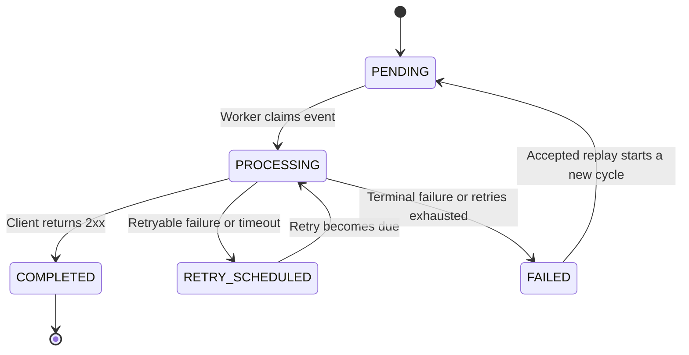

# Notification Delivery Lifecycle

This document defines the state of the current delivery cycle. Individual HTTP
attempts are recorded separately and do not replace the event state.

## States

- `PENDING`: ready to be claimed for delivery.
- `PROCESSING`: currently owned by a worker.
- `RETRY_SCHEDULED`: waiting for the next permitted attempt.
- `COMPLETED`: accepted by the client.
- `FAILED`: the current delivery cycle ended without success.

## State transitions

## Rules

1. A new event starts as `PENDING`.
2. Only a successfully claimed event moves to `PROCESSING`.
3. A `2xx` response completes the current cycle. A timeout is treated as
   ambiguous and follows the retry path.
4. A retryable failure moves to `RETRY_SCHEDULED` while the configured maximum
   number of attempts has not been reached. A permanent failure or an exhausted
   retry policy moves to `FAILED`.
5. Replay is accepted only for `FAILED` events. It starts a new delivery cycle
   with new attempts while preserving the same event identifier.
6. The remote HTTP call runs outside the database transaction. Completing an
   attempt locks its current event and attempt rows, then records both results
   atomically.
7. A duplicated or late result cannot overwrite an attempt that is already
   closed. Successful attempts set the operational `delivered_at`; the source
   `delivery_date` remains unchanged.

## Retry policy

V1 applies one global, configurable policy. `maximum-attempts` includes the
initial attempt, and `delays` provides one duration for every automatic retry.
The default is four total attempts with delays of 1, 5, and 30 seconds.

## Batch processing

V1 processes each claimed batch sequentially and isolates unexpected failures
per event so one notification cannot stop the rest of the batch. Batch size and
lease duration must be configured together: the lease must cover the worst-case
processing time of the sequential batch. If this limits throughput, bounded
parallelism or smaller claims should be introduced before increasing batch size.

## Deferred details

Lease recovery and scheduled polling will be defined in their corresponding
delivery worker increments.
